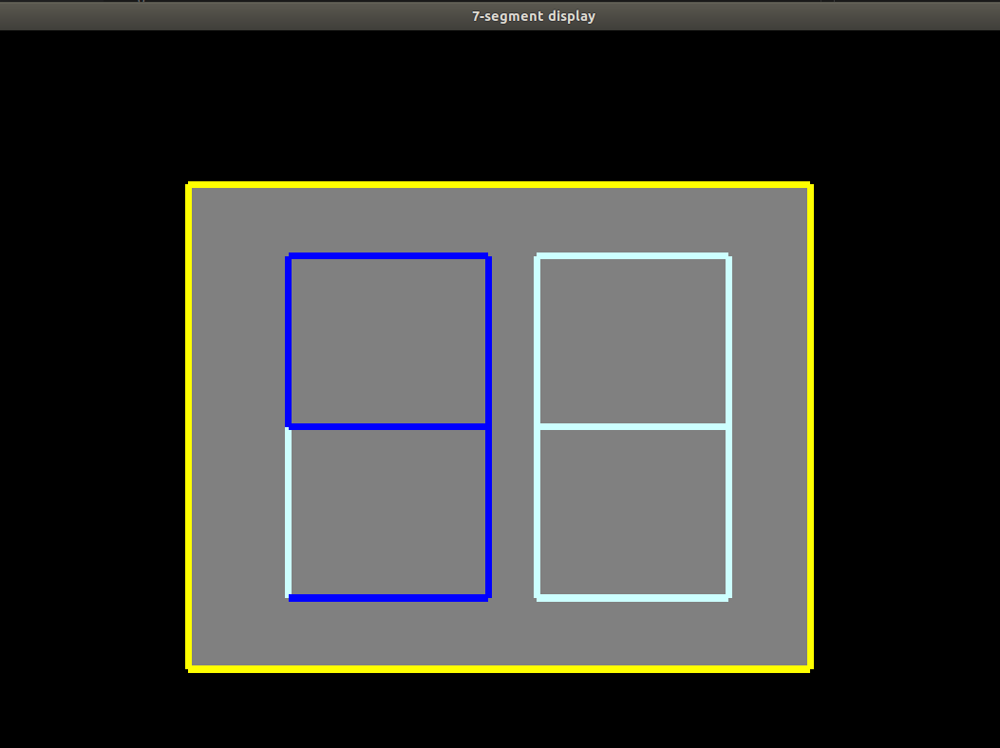

## Helicopter game

This is a **C-code** for simple **Helicopter Game** using **OpenGL** library.

### Steps to run the code.

You need to install OpenGL library.

```
sudo apt-get update.
sudo apt-get install libglu1-mesa-dev freeglut3-dev mesa-common-dev
```

Compiling the code.

```
gcc main.cpp -o out -lglut -lGLU -lGL
```

Running the Code.

```
./out
```

### Sample Output


